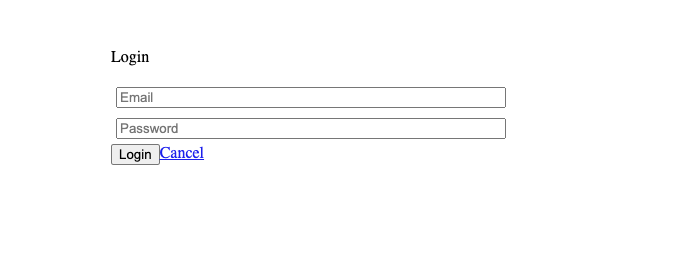
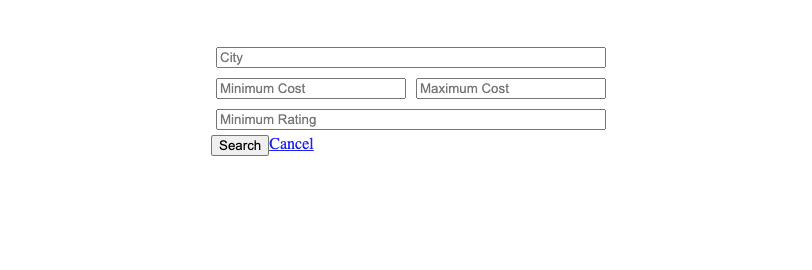

# LightBnB Project

Lighthouse BnB is an app that will revolutionize the travel industry. It will allow homeowners to rent out their homes to people on vacation, creating an alternative to hotels and bed and breakfasts...There’s nothing else like it! Users can view property information, book reservations, view their reservations, and write reviews. We'll be creating the first ever application to do something like this and we will call it LighthouseBnB.

In this project, learners will:

Design the database and create an ERD for the tables.
Create the database and the tables using the ERD.
Add fake data to the database to make testing queries easier.
Write queries.
Connect the database to a JavaScript application in order to interact with the data from a web page.

## Screenshots

## Getting Started

1. [Create](https://docs.github.com/en/repositories/creating-and-managing-repositories/creating-a-repository-from-a-template) a new repository using this repository as a template.
2. Clone your repository onto your local device.
3. Install dependencies using the `npm install` command.
4. Start the web server using the `npm run local` command. The app will be served at <http://localhost:3000/>.
5. Go to <http://localhost:3000/> in your browser.

## Dependencies

- "bcrypt": "^3.0.6",
- "body-parser": "^1.19.0",
- "cookie-session": "^1.3.3",
- "express": "^4.17.1",
- "nodemon": "^1.19.1",
- "pg": "^8.7.3"
- Express
- Node 5.10.x or above
